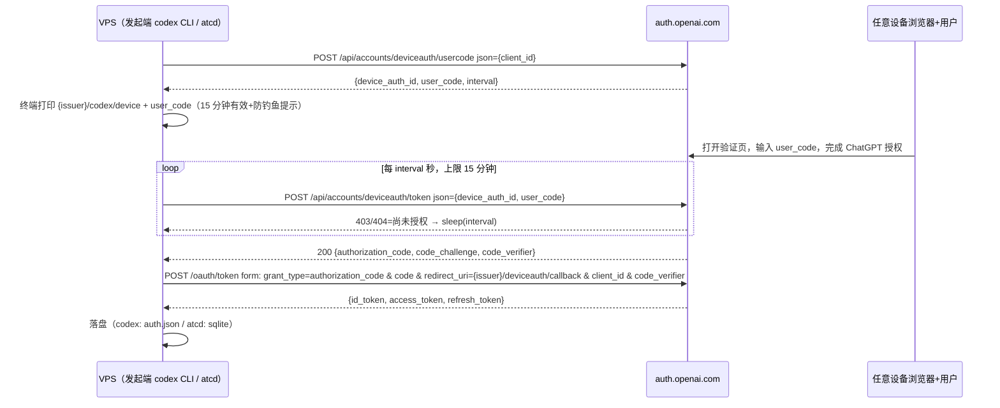
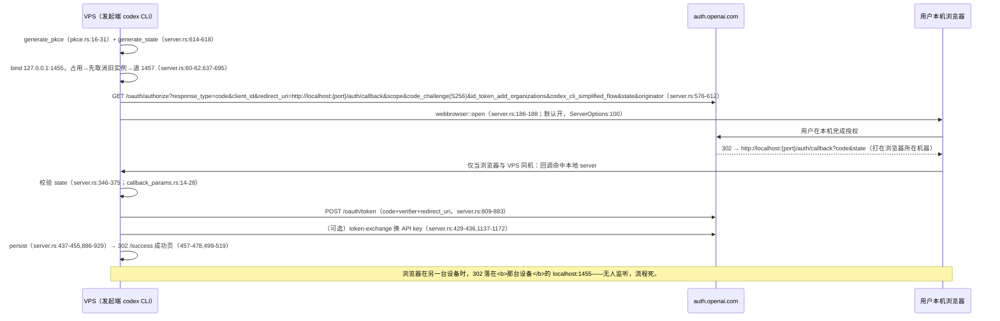

# R10 · codex 跨设备登录真实流程 × atcd web 形态差距

- 日期：2026-09-11 · 只读研究票，未改任何代码
- codex 源码基线：`/home/nixos/.cargo/git/checkouts/codex-db571c5dd4d8f153/9f95fe1/codex-rs/`（main，2026-09 检出）。下文引用统一缩写 `codex-rs/...`
- atcd 现状：`.worktrees/atcd/src/atcd/oauth.rs`（下文缩写 `oauth.rs`）、`src/bin/atcd.rs`、`src/atcd/refresh.rs`
- 结论以源码 `文件:行号` 为准；辅助 web 来源仅佐证产品级事实，已标 URL
- 不确定处显式标 **未验证**

## 0. 四问速答

| # | 问题 | 结论（一句话） |
|---|---|---|
| Q1 | device 流程跨设备性 | 授权完成不回连：VPS 纯出站轮询 `deviceauth/token`，凭 `device_auth_id+user_code` 取回 code+PKCE 对再本地交换；无入站连接、无 localhost、源码无 IP 绑定字段 |
| Q2 | authorize(PKCE) 跨设备性 | `redirect_uri` 固定 localhost 回调；**codex 不存在手动粘贴 code 的路径**，浏览器不在本机时回调必死，官方唯一出路是 `codex login --device-auth`（源码原话） |
| Q3 | atcd web 形态差距 | 粘贴+device 两模式的 wire 已齐；缺的是登录会话注册表（并发/一次性/TTL）、serve 的 HTTP login 路由、state↔login_id↔管理会话绑定；且 codex client_id 的 redirect 白名单只有 localhost:1455/1457 ⇒ web 形态**不可能**用自有域名接 redirect |
| Q4 | 凭据安全边界 | verifier/device_auth_id/refresh_token 全程只应存在于发起端（CLI 或 web 后端）；device 流的 PKCE verifier 由授权服务端生成、随轮询响应下发——**能轮询的人即持 verifier**；web 页面只允许回显 user_code 与最终 account_id，永不回显任何 token |

---

## 1. 流程图 ×2

### 1.1 device 流程（codex 原生远程登录路径）

源码锚点（`codex-rs/login/src/device_code_auth.rs`）：

- 入口 `run_device_code_login`：device_code_auth.rs:234-238
- `request_device_code`：165-179；api base = `{issuer}/api/accounts`（170）；`verification_url = {issuer}/codex/device`（174）
- usercode 请求：`request_user_code` 63-95（URL 拼接 68，body 仅 `{client_id}` 37-39；404=服务未开 device 登录 83-88）
- `DeviceCode` 结构：20-25（`device_auth_id` 为**私有**字段 23，不打印）
- 轮询：`poll_for_token` 100-146（URL 107；上限 `15*60`s 硬编码 108；**403/404 视为未授权继续轮询** 131-138；其余非 2xx 直接报错 141-143）
- 轮询成功响应体 `CodeSuccessResp { authorization_code, code_challenge, code_verifier }`：55-60 —— **PKCE 对由授权服务端生成并随轮询下发**
- 组装 PKCE + `redirect_uri={issuer}/deviceauth/callback`：198-201、202
- 交换：复用 `server::exchange_code_for_tokens`（204-211 → server.rs:809-883，form 拼装 837-843）
- workspace 校验 + 落盘：215-219、222-230（persist → server.rs:886-929）

### 1.2 authorize(PKCE) 流（本机浏览器回调）

CLI 对用户的原话（`codex-rs/cli/src/login.rs`）：

- 116-120：`Starting local login server on http://localhost:{port}. If your browser did not open, navigate to this URL to authenticate: … On a remote or headless machine? Use \`codex login --device-auth\` instead.`（调用点 165、418）
- headless 检测：366-370 注释明说"优先 device（`open_browser=false`），NotFound 再回退浏览器登录"；实现 406（`opts.open_browser = false`）→ 408-415（先 device，`ErrorKind::NotFound` 才回落 `run_login_server`）
- TUI/app-server 面：URL 也只是展示出来（`tui/src/onboarding/auth.rs` 571-590 "If the link doesn't open automatically…"、949-957 `ChatGptContinueInBrowser`），回调约束不变

---

## 2. 逐问题结论

### Q1 · device 流程跨设备性：回连 = 出站轮询，无 IP 绑定

- **回连机制**：不存在任何"授权服务器 → VPS"的入站连接。授权完成的信号通过 VPS 主动轮询 `/api/accounts/deviceauth/token` 获得（device_code_auth.rs:100-146）；轮询请求体只有 `device_auth_id` 与 `user_code`（42-45），**源码中无 IP、设备指纹、nonce 等绑定字段**（usercode 请求体亦仅 `client_id`，37-39）。
- **无 localhost 依赖**：device 流的 `redirect_uri = {issuer}/deviceauth/callback`（202）是授权域下的服务端回调页，不需要任何本地监听口——这就是 codex 官方的远程登录路径（cli/src/login.rs:118 明示远程/headless 用 `--device-auth`）。
- **时间窗**：15 分钟硬上限（108、132-135），提示文案同样写 15 分钟（155）。
- **未验证**：auth.openai.com 服务端是否在 usercode 校验/交换时做 IP 风控（源码不可见）。辅助佐证仅表明 `--device-auth` 是官方远程登录面、且存在与代理相关的登录故障案例（https://community.openai.com/t/codex-cli-login-fails-on-windows-auth-openai-com-reachable-via-curl-but-oauth-device-auth-fail/1381736 、https://segmentfault.com/a/1190000047810666 ），不构成 IP 绑定证据。

### Q2 · authorize(PKCE) 流跨设备性：localhost 回调，无粘贴路径

- `redirect_uri` 是 `http://localhost:{actual_port}/auth/callback`（server.rs:176），本地 server 只绑 `127.0.0.1:1455`（退 1457）（60-62、637-639）。**这是回调型，不是可粘贴型设计**。
- 浏览器不在本机时的行为：CLI 把完整 authorize URL 打到 stderr 供人复制（cli/src/login.rs:116-120），但即便用户在另一台设备打开并授权，302 落在**那台设备**的 localhost:1455——无人监听，流程死。codex 对此场景的官方答案是唯一的：换 `codex login --device-auth`（同句原话）；headless 检测下甚至直接优先 device 流（366-370、406-415）。
- **"用户手动复制 code"的路径不存在**：`login/src` 全目录 grep `paste|Paste|manual|manually` 仅命中一条无关注释（server.rs:537）。回调 code 只由本地 HTTP server 从 query 接收（server.rs:326-402）。
- atcd 的"粘贴回调 URL"模式（复制整条回调地址栏 URL 回 VPS）是**自实现形态**，非 codex 行为；但其 wire 与 codex 逐字兼容——Hydra 只要求交换时的 `redirect_uri` 与 authorize 时一致（均为 `http://localhost:1455/auth/callback`），回调页打不开不影响手工搬运 URL。state 校验与交换已实现（oauth.rs:288-308、141-184）。白名单依据：server.rs:60-62 注释 "Keep in sync with the Codex CLI Hydra redirect URI allow-list"（1455/1457）；**服务端白名单本身未验证**，但 codex 把客户端 redirect 集合写死为这两个端口。

### Q3 · atcd web 形态（sub2api 式）差距清单

**关键约束（新结论）**：codex `client_id = app_EMoamEEZ73f0CkXaXp7hrann`（`codex-rs/login/src/auth/manager.rs:1724`）的 Hydra redirect 白名单 = `localhost:1455/1457`（server.rs:60-62）。⇒ web 后端**不可能**用此 client_id 在自有域名上接收 redirect；PKCE 流只剩"粘贴回调"一种可行形状，或者改走 device 流。sub2api 式 web 页的现实形态 = 页面发起 + 后端持密 + 人工搬运（粘贴）或后端代轮询（device）。

**已实现**（无需重做）：

| 能力 | 位置 |
|---|---|
| PKCE 生成（64B→b64url，S256） | oauth.rs:44-55（镜像 codex pkce.rs:16-31） |
| state 生成 | oauth.rs:57-62（镜像 server.rs:614-618） |
| authorize URL（全参数） | oauth.rs:64-94（镜像 server.rs:584-612） |
| 交换（form 四件套） | oauth.rs:141-184（镜像 server.rs:809-843） |
| 粘贴回调解析 + state 校验 | oauth.rs:288-308 |
| device 三件套（usercode/轮询/交换） | oauth.rs:195-286 + bin/atcd.rs:310-340 |
| 刷新 grant（账号级，JSON body） | refresh.rs:1-26（镜像 auth/manager.rs） |
| 多账号落库 sqlite | bin/atcd.rs:266-293 |

**差距清单（web 化需要补的）**：

1. **登录会话注册表**（最大缺口）：现在 `(pkce, state)` 是 CLI 进程局部变量（bin/atcd.rs:344-345），天然单并发、随进程消亡。web 形态需要 `login_id → {verifier?, state?, device_auth_id?, user_code?, issuer, created_at, status}` 的会话表（sqlite 或内存 HashMap+TTL），**单次消费、TTL 对齐 device 15min（PKCE 粘贴自设 ~10min）**，完成/失败都要清理。
2. **serve 的 HTTP login 路由**：`atcd serve` 只挂代理（`ATCD_LISTEN` 默认 127.0.0.1:8400，bin/atcd.rs:16），login 目前是 CLI 子命令（bin/atcd.rs:75-78）。需要：
   - `POST /login/pkce/start` → `{authorize_url, login_id}`（后端生成并保管 verifier+state）
   - `POST /login/pkce/complete` `body={login_id, callback_url}`（后端跑 parse_callback_url+exchange；一次性消费 login_id）
   - `POST /login/device/start` → `{verification_url, user_code, login_id}`
   - `GET /login/device/status?login_id` → `pending|done|expired`（后端按 interval 代轮询或惰性轮询）
   - 完成即入库账号，响应只回 `account_id/status`。
3. **state 防 CSRF 的 web 化增量**：生成与校验已齐（oauth.rs:57-62、288-308）；缺的是三方绑定 `state ↔ login_id ↔ 管理会话/浏览器 cookie` 与一次性消费（防拿旧回调 URL 重放换 token——code 本身一次性可兜底大半，但会话绑定仍该做）。
4. **多账号并发登录**：账号表已支持多行；device 流各持独立 `device_auth_id` 天然可并发；PKCE 并发靠差距 1 的注册表隔离，否则两个登录的 state/verifier 会串。
5. **token 刷新的 Web 会话管理**：刷新本就是后端账号级（refresh.rs:1-26，POST /oauth/token JSON，响应三 token 均可选=可能轮换），web 形态**不需要**把 refresh_token 暴露给浏览器。待确认两件：轮换后的 refresh_token 是否有写回 store 的路径；刷新失败→账号冷却/报废的调度是否被 scheduler.rs 覆盖（本轮未读，**未验证**）。
6. **codex 有而 atcd 未镜像（有意省略，记录在案）**：`obtain_api_key` token-exchange（server.rs:1137-1172，PKCE 成功后可选换 API key，调用点 429-436）与 `ensure_workspace_allowed`（server.rs:932-946；device 侧 device_code_auth.rs:215-219）。当前产品边界（B2，无计费/分组面）不需要。

### Q4 · 凭据安全边界：哪端出现什么

| 凭据 | 产生于 | 流经 | 终点 / web 形态约束 |
|---|---|---|---|
| `code_verifier`（PKCE 流） | 发起端生成（server.rs:161；pkce.rs:16-31） | 仅发起端内存；challenge 公开进 authorize URL | 只活在后端登录会话表，永不进浏览器/日志 |
| `code_verifier`（device 流） | **授权服务端生成**，随轮询响应下发（device_code_auth.rs:55-60、198-201） | 轮询响应 → 发起端 | **能轮询的人即持 verifier** ⇒ `{device_auth_id, user_code}` 组合就是事实凭证；后端代轮询时二者都留在后端 |
| `device_auth_id` | usercode 响应（29） | 仅发起端 | 私有字段不打印（23）；web 后端保管，不回显 |
| `user_code` | usercode 响应（30-31） | 终端/网页展示 | 设计上就是给人看的；页面展示无妨，但要带上 codex 同款防钓鱼提示（device_code_auth.rs:156） |
| `state` | 发起端生成（server.rs:614-618） | authorize URL ↔ 回调校验（oauth.rs:288-308） | web 化后必须一次性 + 与 login_id 绑定（Q3-3） |
| `authorization_code` | 回调 query / 轮询响应 | 一次性、短命 | 交换即焚；粘贴模式下短暂出现在用户地址栏（接受的成本） |
| `access_token` / `id_token` | 交换响应（server.rs:876-882） | 发起端 → 存储 | 落 atcd sqlite（bin/atcd.rs:266-293）；web 响应永不回显 |
| `refresh_token` | 交换响应（server.rs:881） | 发起端 → 存储 | **最高价值长效凭据**：只存在于后端 store；codex 落 auth.json/keyring（server.rs:886-929），atcd 落 sqlite；web 页面零接触 |
| `api_key`（codex 附加产物） | token-exchange（server.rs:1137-1172） | 发起端 → auth.json（910-918） | atcd 无此物（有意省略） |

传输面：两流程全部为发起端 → issuer 的 HTTPS 出站；无入站监听（device）；PKCE 的本地监听只服务回调。源码内无 IP 绑定逻辑（基于 request 体字段穷举，37-45）——服务端风控行为**未验证**。

---

## 3. 顺带发现：atcd 与 codex 的 wire 分歧点（只记录，不改）

1. **轮询 pending 信号不一致**：codex 以 **403/404** 为"尚未授权、继续轮"（device_code_auth.rs:131-138），400 属"其他错误"直接失败（141-143）；atcd 相反——**400** 视为 pending 继续（oauth.rs:264-266），403/404 落入 else 分支报错（oauth.rs:279-280）。两者必有一个不符真实服务行为，需实测裁决（**未验证**）。
2. **interval 缺省值**：codex 响应缺 interval 时 `serde(default)` 落 0（device_code_auth.rs:32-33）；atcd 缺省取 5（oauth.rs `default_interval`）。小差异，真实服务总会带 interval（字符串数字，codex 有专用反序列化 35-45 区间的 `deserialize_interval`）。
3. **obtain_api_key / workspace 校验未镜像**：见 Q3-6，有意省略。
4. **bin/atcd.rs 注释失真**：304-306 注释仍写"device 流程：codex-login 的公开导出完成 usercode 请求、轮询与交换（令牌经 File store 落 staging codex_home 的 auth.json）……"，这是 R1 撤引用前的旧实现描述；现行实现是自研 wire（307-309 注释、oauth.rs）。两段并存，前者已过时（是否修注释由主 agent 决定，本票只读）。

## 4. 来源清单

源码（结论唯一依据）：

- `codex-rs/login/src/device_code_auth.rs`：20-25, 29-34, 37-45, 55-60, 63-95, 100-146, 149-163, 165-179, 181-231, 234-238
- `codex-rs/login/src/server.rs`：59-62, 68-110, 112-118, 159-188, 326-530, 576-618, 637-695, 809-883, 886-929, 1137-1172
- `codex-rs/login/src/pkce.rs`：全文（16-31 核心生成）
- `codex-rs/login/src/callback_params.rs`：14-28
- `codex-rs/cli/src/login.rs`：116-120, 140-168, 319-364, 366-441
- `codex-rs/tui/src/onboarding/auth.rs`：571-590, 949-957（URL 展示面）
- `codex-rs/login/src/auth/manager.rs`：1724（CLIENT_ID）
- atcd：`src/atcd/oauth.rs`（全文 1-362）、`src/bin/atcd.rs`（10-13, 16, 75-78, 244-370）、`src/atcd/refresh.rs`（1-43）
- 台账：`docs/atcd-requirements.md` R1/R1a/R10（26, 32, 37 行）

辅助 web（仅佐证产品级事实，非结论依据）：

- https://community.openai.com/t/codex-cli-login-fails-on-windows-auth-openai-com-reachable-via-curl-but-oauth-device-auth-fail/1381736 （`--device-auth` 是官方远程登录面）
- https://segmentfault.com/a/1190000047810666 （codex 两种认证方式盘点）
